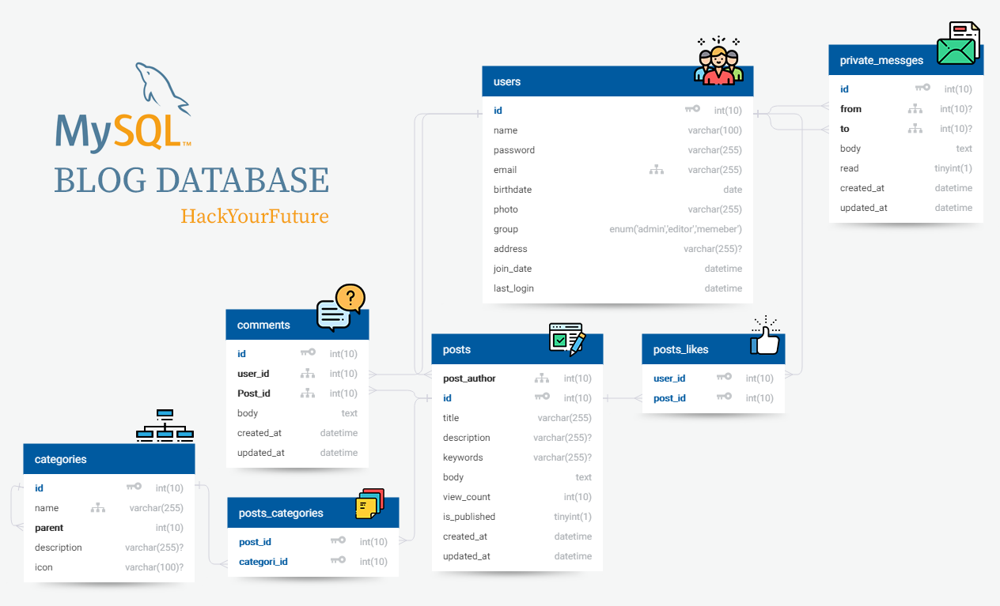
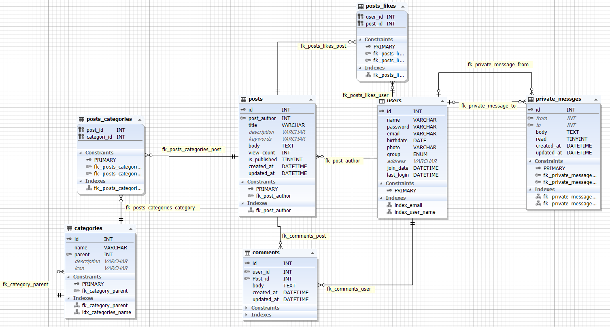
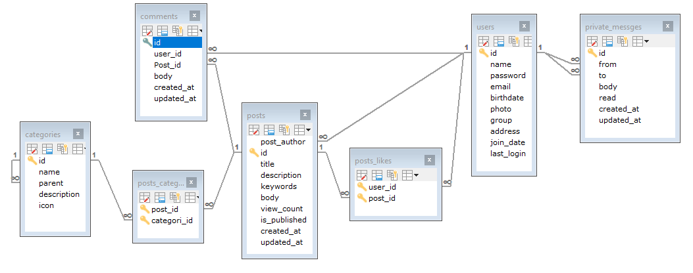

# MySQL week 3 Homework

## Homework Question

For this week's homework:

Using an entity relationship diagram, design the data model for an application of your choice; this could be anything, but previous students have used a small business (with staff, offices, and job titles), a library (with books, genres, racks, members, and a borrowing log), or a farm (with animals, barns, and farmers). Your application must include at least one many-to-many relationship and any supporting tables (associative entities) that are needed. The entity relationship diagram must describe what tables you will need, the columns in these tables, which column is the primary key, and the relationships between tables.

Next, using the entity relationship diagram as a starting point, write all the necessary `CREATE TABLE` statements to create all tables and relationships (foreign key constraints) for this data model.

Submit an image or PDF of your entity relationship diagram, and a `.sql` file with the `CREATE TABLE` statements.

## Blog database
This is a blog diagram, for CMS "Content Management System".
* The blog has many categories, and each category could has sub catigories
* Ecah category has many posts. The post could belogn for on or more category, so the relation between posts and categories is many to many
* User can create posts, contact with another users by sending private messages. Also users can add comments for posts and add 👍 like on posts. So later we can calculate how many likes for each post.
* This ER diagram is similar partially to a real diagram I used at my [website](https://tahasoft.com)

## SQL File

[sql file](hyfblog 20181017 1812.sql)

## ERD Diagram

[Open ERD image](https://zuhairtaha.github.io/tasks-mysql-nodejs-app/MySQL_3_Homework/UML.png)

[giragram code](https://app.quickdatabasediagrams.com/#/schema/zRyxL2m0MUmc0rZOxyP-sg)

## ERD after creating the database

### dbForge Studio for MySQL diagram

### SQLyog diagram

